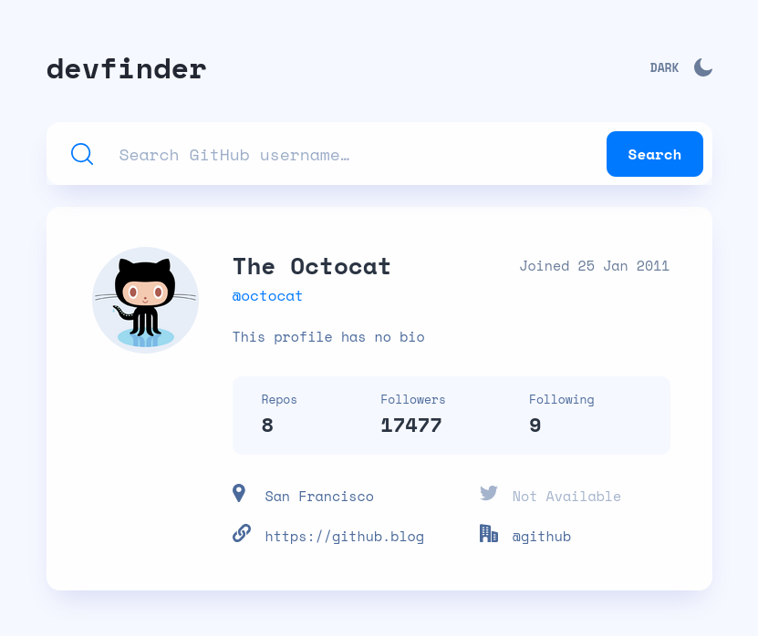
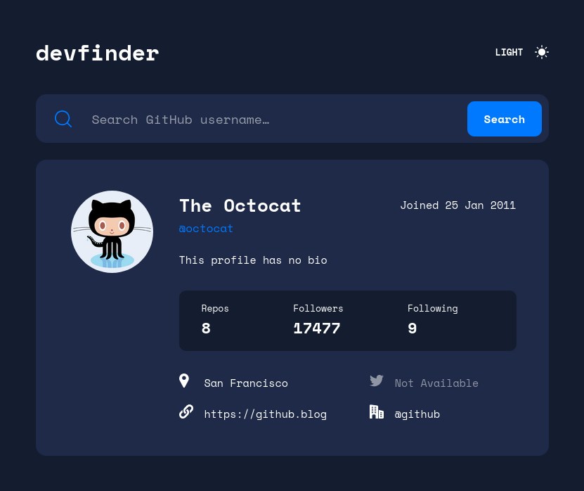
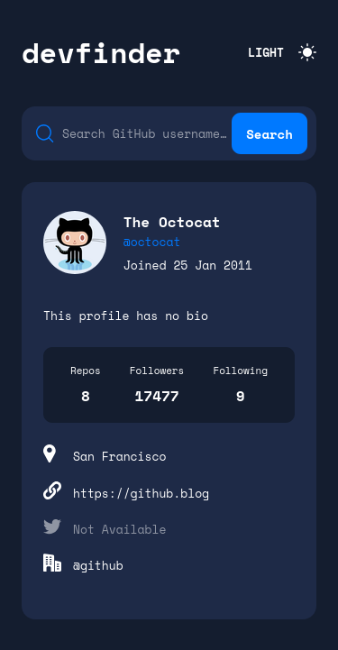

# Frontend Mentor - GitHub user search app solution

This is a solution to the [GitHub user search app challenge on Frontend Mentor](https://www.frontendmentor.io/challenges/github-user-search-app-Q09YOgaH6). Frontend Mentor challenges help you improve your coding skills by building realistic projects. 

## Table of contents

- [Overview](#overview)
  - [The challenge](#the-challenge)
  - [Screenshot](#screenshot)
  - [Links](#links)
- [Built with](#built-with)
- [Author](#author)

## Overview

### The challenge

Users should be able to:

- View the optimal layout for the app depending on their device's screen size
- See hover states for all interactive elements on the page
- Search for GitHub users by their username
- See relevant user information based on their search
- Switch between light and dark themes

### Screenshot

#### Desktop

|  |  |
| -------------------------------------------- | -------------------------------------------- |

#### Mobile

|  |  |
| -------------------------------------------- | -------------------------------------------- |

### Links

- Solution URL: [https://www.frontendmentor.io/solutions/github-search-user---react-yRK2V-hFoh](https://www.frontendmentor.io/solutions/github-search-user---react-yRK2V-hFoh)
- Live Site URL: [https://github-user-search-yo1r.netlify.app/](https://github-user-search-yo1r.netlify.app/)

## Built with

- Semantic HTML5 markup
- CSS custom properties
- Flexbox
- CSS Grid
- [React](https://reactjs.org/) - JS library

## Author

- Frontend Mentor - [@dspereira](https://www.frontendmentor.io/profile/dspereira)

